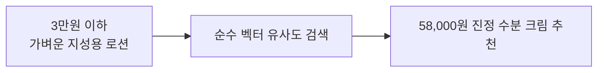
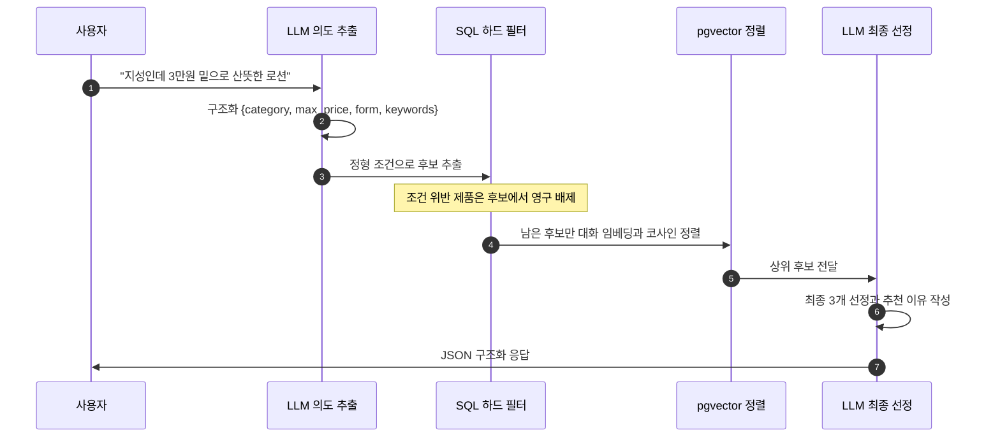
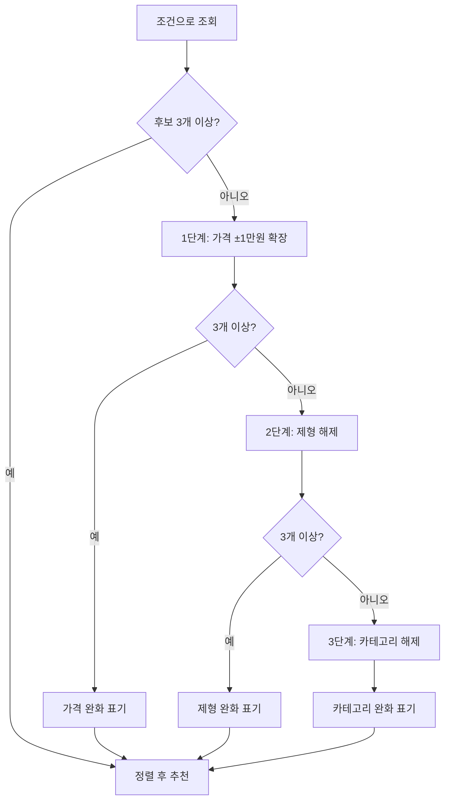
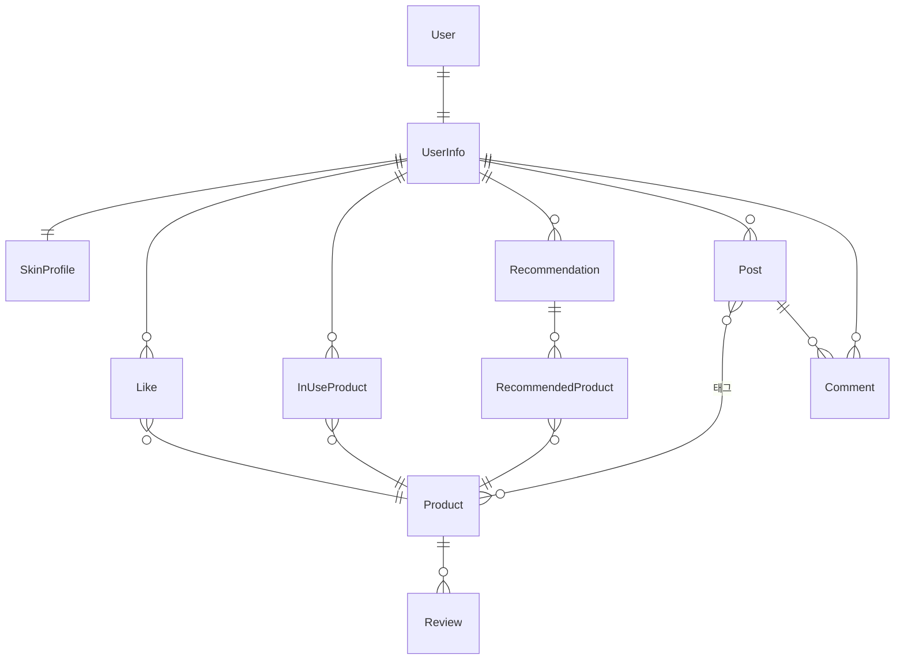

<div align="center">

# beautalk

**당신의 뷰티 상담사, 뷰토크**

대화하듯 물어보면 내 피부와 예산에 맞는 화장품을 추천해 주는 AI 서비스입니다.

<a href="https://beautalk.site"></a>
<a href="https://drive.google.com/file/d/1HtXHQ51Gx0hAQJea4NhGExRa2KNZrCsh/view"></a>


</div>

---

## 서비스 소개

화장품은 성분, 제형, 내 피부 타입을 동시에 따져야 해서 입문자에게는 고르기가 막막합니다.

beautalk는 **AI 상담사와 대화**하면서 피부 타입, 고민, 예산을 자연스럽게 풀어놓으면 그에 맞는 실제 제품을 **이유와 함께** 추천합니다. 데이터는 올리브영에서 수집한 제품과 리뷰를 정제해 씁니다.

**핵심은 이 한 줄입니다.** 의미만 비슷한 추천이 아니라, **내 조건을 반드시 지키는 추천**입니다.

## 팀

2인 프로젝트입니다.

| 이름 | 역할 | 담당 | GitHub |
| :---: | :---: | --- | :---: |
| 김채은 | Frontend | Vue SPA, 디자인 시스템, 추천과 커뮤니티 화면, 프론트 배포 | [c7aeun](https://github.com/c7aeun) |
| 장준환 | Backend | Django REST, 인증과 보안, 데이터 파이프라인, 하이브리드 추천 엔진, 인프라 배포 | [prgmd](https://github.com/prgmd) |

`develop` + 기능 브랜치 + PR 리뷰로 진행했고, **API 계약서로 인터페이스를 먼저 합의한 뒤** 프론트엔드와 백엔드가 병렬로 개발했습니다.

---

## 순수 벡터 검색은 왜 실패했나

초기 프로토타입은 사용자 발화를 통째로 임베딩해 제품과 코사인 유사도를 비교했습니다. 결과가 이랬습니다.



가격도 제형도 틀렸는데 유사도는 높습니다. 이유는 두 가지입니다.

**하나, 임베딩은 이진 규칙을 보장하지 못합니다.** 고차원 공간에서 의미적 뉘앙스는 잘 포착하지만 `price <= 30000`이나 `category = 'LOTION'`처럼 **참과 거짓으로 갈리는 조건은 수학적으로 강제할 수 없습니다.** 유사도는 연속적인 값이고, 조건 위반은 불연속적인 사건입니다.

**둘, 공통 키워드가 카테고리를 넘습니다.** "진정", "민감성"이라는 표현은 로션에도 크림에도 앰플에도 있습니다. 그래서 로션을 찾는데 크림이 더 높은 점수를 받습니다.

결론은 **조건과 취향을 분리해야 한다**는 것이었습니다.

---

## 하이브리드 추천 파이프라인



**타협할 수 없는 조건은 SQL이 보장하고, 유사할수록 좋은 취향은 벡터가 정렬합니다.** LLM은 이미 조건을 통과한 후보만 봅니다. 조건 위반 제품은 LLM에게 보이지조차 않으므로, LLM이 실수로 고를 가능성이 원천 차단됩니다.

---

## 설계 판단

<details>
<summary><b>하드 조건과 소프트 취향을 층으로 나눈 이유</b></summary>

<br/>

같은 "조건"이라는 말 안에 성질이 다른 두 가지가 섞여 있었습니다.

| | 예시 | 성질 | 담당 |
| --- | --- | --- | --- |
| **하드** | 3만원 이하, 로션 | 위반하면 추천 자체가 틀림 | SQL `WHERE` |
| **소프트** | 산뜻한, 지성 피부에 맞는 | 가까울수록 좋음 | pgvector 코사인 |

하드 조건을 벡터에 맡기면 "거의 3만원"인 3만 5천원이 통과합니다. 소프트 취향을 SQL에 맡기면 "산뜻함"을 컬럼으로 정의해야 합니다. **각자 잘하는 것에 배치한 것**이 이 설계의 전부입니다.

제형은 `ArrayField`로 두고 overlap으로 매칭합니다. 한 제품이 여러 제형에 걸치는 경우가 있어서입니다.

</details>

<details>
<summary><b>후보가 부족할 때 — 단계적 완화와 정직한 표기</b></summary>

<br/>

조건이 까다로우면 SQL 필터 결과가 0개가 됩니다. 빈 화면을 주는 대신 **우선순위에 따라 조건을 순서대로 풉니다.**



순서에 의도가 있습니다. **가격을 가장 먼저, 가장 조금 풉니다.** 예산은 사용자가 가장 양보하기 싫은 조건이라고 보고 `±10,000원`만 확장합니다. 그다음이 제형, 마지막이 카테고리입니다. 카테고리를 풀면 "로션 찾는데 크림이 나오는" 상태가 되므로 최후에 둡니다.

**무엇을 풀었는지 숨기지 않습니다.** 응답에 완화한 축을 담아 내려보내고, 제품별로 원래 조건을 충족했는지를 `✓ 충족 / ✗ 완화됨`으로 표시합니다. 완화 자체보다 **완화를 숨기는 것**이 신뢰를 깎는다고 봤습니다.

다 풀어도 3개가 안 될 수 있습니다. 그때는 있는 만큼 반환합니다. 추천이 멈추는 것보다 낫습니다.

</details>

<details>
<summary><b>LLM이 지어낸 제품을 어떻게 막는가</b></summary>

<br/>

LLM은 존재하지 않는 제품 ID를 만들어내거나 다른 제품의 설명을 뒤섞습니다. 후보를 좁혀 줘도 생성 단계에서 새로 지어낼 수 있습니다.

세 겹으로 막았습니다.

1. **출력을 JSON으로 강제** — 파싱에 실패하면 그 응답을 버리고 502로 알립니다. 형식이 깨진 응답을 억지로 해석해 쓰지 않습니다
2. **ID를 DB로 재조회** — LLM이 고른 ID를 실제 조회해 존재하지 않는 것을 걸러냅니다. 이때 **LLM이 고른 순서는 유지하고 중복만 제거**합니다. 순서에도 LLM의 판단이 들어 있기 때문입니다
3. **개수 상한 강제** — 프롬프트에 3개라고 써도 4개를 줄 수 있으므로 코드에서 잘라냅니다

검증 후 유효한 제품이 **하나도 없으면 빈 결과를 저장하지 않고 실패로 응답합니다.** 빈 추천 배치를 DB에 남기면 히스토리에 의미 없는 기록이 쌓입니다.

</details>

<details>
<summary><b>대화 단계와 추천 단계를 나눈 이유</b></summary>

<br/>

엔드포인트가 두 개입니다.

- `POST /api/v1/chat/` — 문답으로 조건을 모읍니다. 제품군, 제형, 가격대, 피부고민 네 축이 채워지면 응답에 "이제 추천할 수 있다"는 플래그를 담습니다
- `POST /api/v1/recommend/` — 사용자가 버튼을 누르면 그때 추천을 생성합니다

**대화 히스토리를 서버가 들고 있지 않습니다.** 프론트엔드가 유지하고 매 요청에 실어 보냅니다. 서버가 무상태라 세션 저장소가 필요 없고, 인스턴스를 늘려도 대화가 끊기지 않습니다.

추천을 대화에서 분리한 이유는 **비용과 시점** 때문입니다. 추천 생성은 후보 조회와 긴 프롬프트가 붙어 대화보다 무겁습니다. 매 발화마다 돌리면 낭비이고, 사용자가 아직 조건을 다 말하지 않았을 수도 있습니다. 버튼을 누르는 행위가 "이제 됐다"는 신호가 됩니다.

</details>

<details>
<summary><b>임베딩 검색이 실패하면 어떻게 되는가</b></summary>

<br/>

벡터 정렬은 외부 임베딩 API 호출에 의존합니다. 그 호출이 실패하면 추천 전체가 멈출 수 있습니다.

그래서 **리뷰 수 내림차순으로 폴백**합니다.

```python
try:
    query_vector = embed_text(query_text)
    return list(embedded.order_by(CosineDistance('embedding', query_vector))[:POOL])
except Exception as e:
    logger.warning('임베딩 검색 실패, 리뷰순 폴백: %s', e)
return list(qs.order_by('-review_count')[:POOL])
```

품질은 떨어지지만 **하드 조건은 이미 SQL이 통과시킨 상태**입니다. 즉 폴백이 걸려도 가격과 제형은 여전히 맞습니다. 소프트 정렬만 거칠어집니다.

계층을 나눈 설계의 부수 효과입니다. 하드와 소프트가 한 덩어리였다면 한쪽 실패가 전체 실패가 됩니다.

</details>

<details>
<summary><b>SDK 없이 REST로 호출하는 이유</b></summary>

<br/>

LLM과 임베딩 호출은 `requests`로 직접 합니다. 의존성 목록에 `openai` 패키지가 없습니다.

호출 대상이 **OpenAI 호환 프록시(GMS)** 라서입니다. 베이스 URL만 바꾸면 같은 요청 형식이 그대로 통하고, 임베딩 엔드포인트도 같은 베이스 아래에 있어 URL 치환으로 얻습니다.

```python
GMS_EMBED_URL = _CHAT_URL.replace('/chat/completions', '/embeddings')
```

SDK를 쓰면 버전이 올라갈 때 인터페이스가 바뀌고, 프록시 주소를 주입하는 방법도 버전마다 다릅니다. **REST 요청 형식은 고정되어 있어서** 그 변화에 영향받지 않습니다.

</details>

<details>
<summary><b>LangSmith를 선택적 의존으로 둔 이유</b></summary>

<br/>

추천 후보 생성 함수에 `@traceable`을 붙여 LangSmith로 추적합니다. 어떤 조건이 어떤 후보를 뽑았고 어디서 완화가 걸렸는지를 보려면 관측이 필요합니다.

다만 **관측 설정이 없어도 서비스는 돌아가야 합니다.** 그래서 환경변수가 없으면 데코레이터가 아무 일도 하지 않는 no-op으로 동작하도록 감쌌습니다.

관측은 운영을 돕는 도구이고 **서비스의 필수 경로가 아닙니다.** 필수가 아닌 것을 필수로 만들면 로컬 개발과 테스트에서 불필요한 설정을 요구하게 됩니다.

</details>

<details>
<summary><b>추천 품질을 자동으로 평가한다</b></summary>

<br/>

`eval_recommend` 관리 명령으로 추천 결과를 일괄 평가합니다. 여기서 측정하는 것이 **조건 충족률**입니다.

핵심은 이 관찰입니다.

> **완화가 일어나지 않은 쿼리는 조건 충족률이 100%다.** SQL이 위반 제품을 후보에서 통째로 빼기 때문이다.

즉 이 아키텍처에서 조건 충족은 **확률이 아니라 구조적으로 보장되는 성질**입니다. 프롬프트를 잘 써서 지켜지는 것이 아닙니다.

그래서 평가는 완화가 일어난 쿼리와 그렇지 않은 쿼리를 **분리해서 집계**합니다. 섞으면 구조적 보장이 확률처럼 보이고, 실제로 봐야 할 지표인 "얼마나 자주 완화가 필요했는가"가 가려집니다.

</details>

<details>
<summary><b>한도를 강제하는 것과 보여주는 것을 분리했다</b></summary>

<br/>

LLM 호출에는 한도가 필요합니다. 대화는 하루 100회, 추천은 20회로 제한합니다.

강제는 DRF의 `ScopedRateThrottle`이 합니다. 그런데 사용자에게 "몇 번 남았는지" 보여주려면 별도 카운터가 필요합니다. **둘을 같은 것으로 만들지 않았습니다.**

표시용 카운터가 어긋나도 실제 차단은 throttle이 정확히 막습니다. 반대로 표시를 위해 throttle 내부 상태를 파고들면 프레임워크 구현에 결합됩니다. 한쪽은 정확성이 중요하고 다른 쪽은 편의라서 요구 수준이 다릅니다.

</details>

<details>
<summary><b>1GB 램에서 돌리기</b></summary>

<br/>

배포 환경은 AWS EC2 `t3.micro`입니다. 램이 1GB라 컨테이너를 쌓을 여유가 없습니다.

정적 파일 처리에서 한 겹을 덜어냈습니다. 보통 Nginx가 정적 파일을 직접 서빙하도록 볼륨을 공유하는데, **`whitenoise`를 넣어 Gunicorn이 admin과 DRF 정적 파일을 직접 내려보내게** 했습니다.

덕분에 Nginx와 백엔드 컨테이너가 정적 볼륨을 공유할 필요가 없어졌습니다. 볼륨 마운트 설정, 수집 경로 동기화, 배포 시 순서 의존이 함께 사라집니다.

트래픽이 큰 서비스라면 Nginx가 정적을 처리하는 편이 빠릅니다. **이 규모에서는 구성 단순함이 성능보다 값어치가 있다고 판단했습니다.**

</details>

---

## 주요 기능

| 기능 | 설명 |
| --- | --- |
| **AI 추천 챗봇** | 대화로 조건을 모으고, 버튼을 누르면 추천 3개와 이유를 생성. 조건 충족 배지 표시 |
| **하이브리드 추천 엔진** | SQL 정형 필터와 pgvector 의미 검색의 2겹 구조 |
| **소셜 로그인과 온보딩** | 카카오, 구글 OAuth 2.0. 피부 타입, 고민, 기피 성분 프로필 |
| **제품 카탈로그** | 목록과 상세, AI 리뷰 요약, 피부 타입별 만족도, 찜하기 |
| **커뮤니티** | 자유, Q&A, 세일 게시판. 글에 제품을 태그해 역참조로 후기 모아보기 |
| **마이페이지** | 프로필, 찜 목록, 추천 내역, 계정과 탈퇴 |

---

## 데이터 모델



`Product`에 두 개의 특별한 컬럼이 있습니다.

- `embedding` — `pgvector(1536)`. 리뷰 요약을 임베딩한 결과이고 코사인 정렬의 재료입니다
- `form` — `ArrayField`. 한 제품이 여러 제형에 걸칠 수 있어 배열로 두고 overlap으로 매칭합니다

---

## 기술 스택

| 구분 | 기술 |
| --- | --- |
| **Frontend** | Vue 3 (Composition API), Pinia, Vue Router, Vite |
| **Backend** | Python 3.11, Django 5.2, Django REST Framework, SimpleJWT |
| **Database** | PostgreSQL 16 + pgvector |
| **AI** | GMS (OpenAI 호환 프록시), `gpt-4o` 대화와 추천, `text-embedding-3-small` 임베딩 |
| **관측** | LangSmith (선택적 의존) |
| **서버** | Gunicorn, whitenoise, Nginx, Let's Encrypt |
| **인프라** | AWS EC2 (t3.micro), Docker Compose |
| **인증** | 카카오, 구글 OAuth 2.0, JWT 이중 토큰 |
| **수집** | Selenium (undetected_chromedriver), 올리브영 4개 카테고리 |

대화 모델은 **5종을 실측 비교해 `gpt-4o`를 선정**했습니다.

---

## 인증과 보안

- **JWT 이중 토큰** — Access 30분(인메모리), Refresh 7일(`HttpOnly` 쿠키). 회전과 블랙리스트를 적용합니다. 블랙리스트는 SimpleJWT의 DB 기반 앱을 씁니다
- **IDOR 차단** — 자신이 쓰지 않은 게시글과 댓글의 수정, 삭제를 서버에서 막습니다. 프론트에서 버튼을 숨기는 것만으로는 API 직접 호출을 막지 못합니다
- **호출 한도** — 대화 100회/일, 추천 20회/일
- **시크릿 관리** — 모든 키를 `.env`로 분리하고 저장소에 커밋하지 않습니다

---

## 실행 방법

**요구사항**: Python 3.11+, Node.js 20+, Docker

### 1. 데이터베이스

```bash
docker compose up -d          # pgvector/pgvector:pg16 컨테이너 기동
```

### 2. 백엔드

```bash
cd backend
cp .env.example .env          # DJANGO_SECRET_KEY, GMS_API_KEY, OAuth 키, DB_* 입력
pip install -r requirements.txt
python manage.py migrate
python manage.py loaddata products_seed.json board_seed.json
python manage.py backfill_form         # 제형 백필
python manage.py backfill_embeddings   # 임베딩 적재
python manage.py runserver
```

### 3. 프론트엔드

```bash
cd frontend
npm install
npm run dev
```

---

## 측정 범위와 한계

수치를 어디까지 신뢰할 수 있는지 밝혀 둡니다.

- **조건 충족률 100%는 완화가 걸리지 않은 쿼리에 대한 것입니다.** SQL이 위반 제품을 배제하므로 구조적으로 보장되지만, 완화가 걸린 쿼리는 정의상 원래 조건을 벗어납니다. 그래서 평가에서 두 경우를 분리해 집계합니다
- **모델 비교 결과는 표본과 환경을 함께 기록하지 않았습니다.** `gpt-4o`를 고른 근거로는 썼지만 일반적인 성능 수치로 인용할 수 없습니다
- **제품 데이터는 올리브영 4개 카테고리 306종입니다.** 화장품 시장 전체를 대표하지 않습니다. 카테고리 완화 단계가 자주 걸리는 이유이기도 합니다
- **`t3.micro` 단일 인스턴스입니다.** 무상태 서버라 수평 확장에 걸림돌은 없지만, 현재 구성에서 검증하지는 않았습니다
